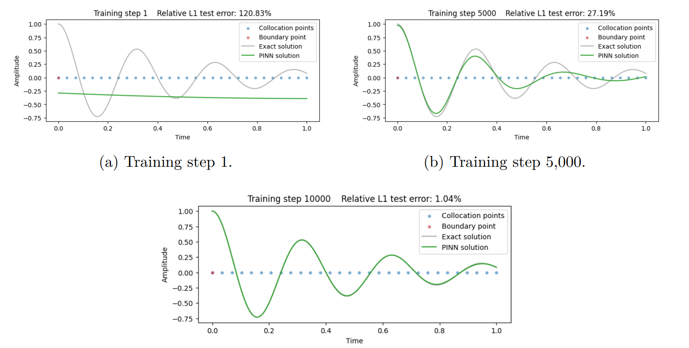
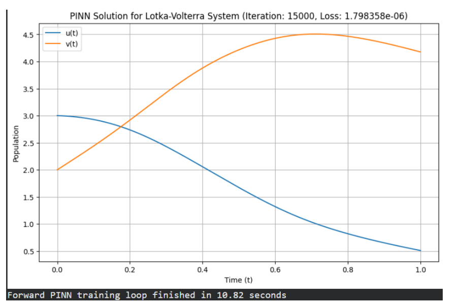
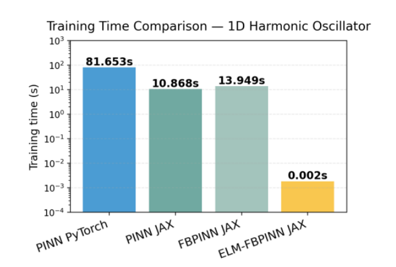

# Physics-Informed Neural Networks for Differential Equations

Implementation of **Physics-Informed Neural Networks (PINNs)** for solving Ordinary Differential Equations (ODEs), developed as part of my **MAC F266 Study Project** at **BITS Pilani, K.K. Birla Goa Campus**.

This repository explores multiple PINN formulations for solving Initial Value Problems (IVPs), Boundary Value Problems (BVPs), inverse problems, and advanced architectures such as **FBPINNs** and **ELM-FBPINNs**, with implementations in both **PyTorch** and **JAX**.

---

## 🚀 Highlights

- Physics-Informed Neural Networks (PINNs)
- Initial Value Problems (IVPs)
- Boundary Value Problems (BVPs)
- Forward & Inverse Problems
- Soft and Hard Constraint Embedding
- Quadrature Loss Formulation
- Hybrid Euler + PINN Method
- Finite Basis PINNs (FBPINNs)
- Extreme Learning Machine FBPINNs (ELM-FBPINNs)
- Comparative implementations in **PyTorch** and **JAX**

---

# Sample Results

## Training Progression



*PINN learning progression for a damped harmonic oscillator showing convergence towards the analytical solution.*

---

## PyTorch vs JAX

*JAX achieves significantly faster training while maintaining comparable solution accuracy.*

---

## Lotka–Volterra System



*Physics-Informed Neural Network solving the Lotka–Volterra predator-prey system.*

---

## Training Time Comparison



*Performance comparison between standard PINNs, FBPINNs and ELM-FBPINNs.*

---

# Repository Structure

```text
Physics-Informed-Neural-Networks
│
├── 1_Forced_Damped_Oscillator
├── 2_Initial_Value_Problems
├── 3_Systems_of_IVPs
├── 4_Boundary_Value_Problems
├── 5_Hard_Constraint_Embedding
├── 6_Quadrature_Loss
├── 7_Inverse_Problems
├── 8_Hybrid_Method
├── 9_FBPINNs_and_ELM
│
├── assets
│   └── images
│
├── Project_Report.pdf
└── README.md
```

---

# Topics Covered

### Initial Value Problems

- Soft Initial Condition Embedding
- Hard Initial Condition Embedding
- Quadrature Loss Formulation
- Cauchy–Euler Equation

### Boundary Value Problems

- Soft Boundary Constraints
- Hard Boundary Constraints
- Parameter Identification

### Advanced PINN Architectures

- Lotka–Volterra Systems
- Hybrid Euler + PINN
- Inverse Parameter Estimation
- Spectral Bias
- Finite Basis PINNs (FBPINNs)
- Extreme Learning Machine FBPINNs (ELM-FBPINNs)

---

# Tech Stack

- Python
- PyTorch
- JAX
- NumPy
- Matplotlib

---

# Key Results

- ⚡ **JAX achieved 5–7× faster training** than equivalent PyTorch implementations using JIT compilation and vectorized automatic differentiation.
- 📈 **Hard constraint embedding** demonstrated faster and more stable convergence compared to soft constraints.
- 🎯 **Hybrid Euler–PINN** achieved solution errors on the order of **10⁻⁵**.
- 🚀 **ELM-FBPINNs** reduced training time by several orders of magnitude by replacing gradient-based optimization with a linear least-squares formulation.

---

# Project Report

A detailed report covering the mathematical foundations, implementation details, experiments, and performance comparisons is included in this repository.

📄 **Project_Report.pdf**

---

# Future Work

- Extension to Partial Differential Equations (PDEs)
- Adaptive collocation strategies
- L-BFGS optimization
- Higher-dimensional FBPINNs
- Real-world scientific computing applications

---

Developed as part of **MAC F266 – Study Project** under the guidance of **Prof. P. Danumjaya** at **BITS Pilani, K.K. Birla Goa Campus**.